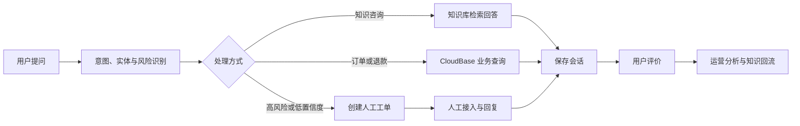

# 言析电商售后智能客服｜作品集演示与面试手册

## 1. 项目介绍

言析智能客服是一套面向电商售后的 AI 客服系统，覆盖知识咨询、订单与退款查询、风险识别、人工工单、服务评价和运营分析完整闭环。

- 在线地址：https://zyy-d1g23eauv3b1b3549-1324088997.tcloudbaseapp.com
- 业务场景：电商售后
- 项目角色：AI 产品经理、流程设计、原型与落地协同
- 技术组合：Coze + React + CloudBase

## 2. 项目目标

普通聊天机器人往往只完成“用户提问—机器人回答”。本项目重点解决：

1. 判断用户属于知识咨询、订单查询、退款申请还是投诉。
2. AI 无法可靠处理时，携带上下文转给人工。
3. 服务结束后沉淀评价、知识缺口和运营指标。

## 3. 业务闭环

## 4. 系统架构

| 模块 | 职责 |
|---|---|
| React 网页 | 客户服务、人工工作台、运营洞察 |
| CloudBase 云函数 | 鉴权、会话编排、数据读写、Coze API 代理 |
| CloudBase 数据库 | 会话、订单、退款、工单、评价和知识缺口 |
| Coze 对话流 | 多轮对话和意图路由 |
| Coze 工作流 | 消息理解、转人工摘要、服务结果分析 |
| Coze 知识库 | 售后政策与常见问题回答 |

安全设计：Coze Token 只保存在云函数环境变量中；网页不接触密钥；导出数据隐藏用户身份标识。

## 5. Coze 核心设计

### `understand_message`：消息理解工作流

输出字段：

- `intent`：用户意图
- `confidence`：置信度
- `order_no`：订单号
- `emotion`：用户情绪
- `risk_level`：风险等级
- `need_handoff`：是否转人工
- `handoff_reason`：转人工原因
- `action`：下一步动作

### `after_sales_chat`：售后主对话流

- 商品与政策咨询 → 检索知识库
- 物流查询 → 查询订单
- 退款进度 → 查询退款
- 退款申请 → 展示退款表单
- 投诉、要求人工、未知问题 → 创建工单

### `generate_handoff_summary`：转人工摘要

将完整对话整理成摘要、用户诉求、关键事实、已完成动作、待处理事项和优先级，方便人工客服快速接手。

### `analyze_service_result`：服务结果分析

会话结束后判断是否解决、失败原因、责任环节和知识缺口，为运营分析提供结构化数据。

## 6. 数据设计

| 集合 | 用途 |
|---|---|
| `sessions` | 会话状态和解决结果 |
| `messages` | 用户、AI、人工消息 |
| `orders` | 模拟订单与物流状态 |
| `refunds` | 退款申请和审核状态 |
| `tickets` | 人工工单和优先级 |
| `ticket_replies` | 人工回复记录 |
| `ratings` | 服务评分与评价内容 |
| `knowledge_gaps` | 未覆盖问题和出现次数 |

## 7. 当前演示指标

- 区间会话：13 次
- AI 自助解决率：77%
- 转人工率：23%
- 平均满意度：4.2 / 5
- 人工工单：3 个
- 服务评价：11 条
- 知识缺口：2 类

以上为可重复构造的演示数据，用来验证业务闭环，不冒充真实商业运营数据。

## 8. 测试结论

- 首轮自动化评测：50 条，39 条通过，通过率 78%。
- 失败构成：6 条识别或规则缺口，5 条 Coze 会话占用或超时。
- 修复方向：补充物流到达、质量问题退换货和退款到账表达。
- 定向回归：11 条失败用例重新测试，11 条全部通过。

面试时应表述为“11 条失败用例回归全部通过”，不要说“完整 50 条二次全量测试全部通过”。

## 9. 五分钟演示脚本

### 0:00–0:40 项目定位

“这是我从零搭建的电商售后智能客服。它不只是聊天机器人，而是覆盖 AI 回答、业务查询、人工兜底、评价和数据分析的业务闭环。”

### 0:40–1:30 知识咨询

输入：`商品签收后几天可以申请无理由退货？`

展示右侧决策轨迹，强调答案来自知识库，而不是模型自由发挥。

### 1:30–2:15 订单查询

输入：`我的订单 OD20260620001 到哪里了？`

展示真实模拟订单数据，说明 AI 不编造业务结果。

### 2:15–3:15 人工兜底

输入：`退款金额不对，我要投诉并转人工处理。`

展示高风险识别、工单创建和转人工摘要；切换人工工作台接入并回复。

### 3:15–4:00 评价闭环

关闭工单，回到客户页面查看回复，提交是否解决、星级和评价意见。

### 4:00–5:00 运营洞察

展示自助解决率、转人工率、满意度、意图分布和知识缺口，并演示导出 Excel 和生成 PDF。

## 10. 高频面试问答

### 为什么同时使用对话流和工作流？

对话流负责多轮会话和业务分支；工作流负责可复用、结构化的单项能力，更方便测试、复用和定位问题。

### 如何控制 AI 幻觉？

知识问题依赖知识库，订单和退款依赖业务数据库；低置信度、未知问题和高风险问题转人工；AI 不自行承诺赔偿金额或处理结果。

### 为什么需要人工工作台？

投诉、金额争议和知识缺口无法完全自动化。人工工作台证明系统有可执行的兜底机制，而不只是回复一句“请联系人工”。

### 为什么没有继续对接飞书？

飞书并非该客服场景的必要环节。最终改成 Excel 数据导出和 PDF 分析报告，更符合客服主管的数据使用习惯，也避免重复存储完整消息。

### 如何衡量项目价值？

核心指标包括 AI 自助解决率、转人工率、满意度、问题解决率、人工处理时长和知识缺口数量。

### 你作为 AI 产品经理做了什么？

我完成了场景选择、业务闭环、意图体系、风险规则、转人工策略、数据模型、页面信息架构、验收标准、测试用例和迭代复盘，并推动 Coze、React 和 CloudBase 联调落地。

## 11. 当前边界与后续规划

当前版本使用匿名用户和模拟订单，CloudBase 个人版云函数存在 3 秒执行上限，Coze Token 需要定期轮换。

后续可增加：

1. 管理员登录和角色权限。
2. 工单分配、SLA 和客服绩效。
3. 真实物流、支付与订单系统。
4. 知识缺口审核后一键回流知识库。
5. 全量自动化回归与响应耗时监控。

## 12. 项目亮点

1. 从聊天功能升级成完整客服业务闭环。
2. 知识回答、业务查询、人工兜底明确分层。
3. AI 决策轨迹可解释，便于演示和复盘。
4. 人工接管携带上下文，减少重复沟通。
5. 评价、知识缺口、Excel 和 PDF 构成运营闭环。
6. 经历真实测试、问题定位、规则修复和回归验证。
